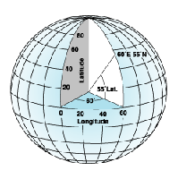

# 坐标系 #

## 地理坐标系 ##
地理坐标系，使用三维球面来定义地球上的位置，通过经度、维度来指定地球表面上的点。

## 投影坐标系 ##

# OGC #

开放地理空间联盟 (OGC) 的 Web 地图服务 (WMS) 规范是一种在 web 上提供和使用动态地图时需遵守的国际规范。如果要在不同的平台和客户端之间以一种开放并经认可的方式提供 Web 地图，则 WMS 服务非常有用。任何原生支持 WMS 规范的客户端均可查看和使用您的服务。到目前为止，已发布了四个版本的 WMS 规范。这些版本是 v1.0.0、v1.1.0、v1.1.1 和 v1.3.0（最新版本）。

## WMS ##

Web 地图服务（WMS）能够根据用户的请求返回相应的地图（包括PNG，GIF，JPEG等栅格形式或者是SVG和WEB CGM等矢量形式）。客户端应用程序通过向服务的 URL 附加参数来使用 WMS 服务。

规范中定义的WMS支持的操作包括:
- 请求服务的元数据(GetCapbilities) 
- 请求地图图像(GetMap) 
- 请求关于地图要素的信息 (GetFeatureInfo) 
- 请求用户自定义样式 (GetStyles) 
- 请求图例符号 (GetLegendGraphic)

由各种不同GIS Server发布的WMS服务无需支持所有操作，但如果作为基本 WMS，则必须至少支持 GetCapabilities 和 GetMap 操作。

WMS GetCapabilities实例
http://sampleserver1.arcgisonline.com/ArcGIS/services/Specialty/ESRI_StatesCitiesRivers_USA/MapServer/WMSServer?service=WMS&request=GetCapabilities&version=1.3.0

GetMap实例
http://sampleserver1.arcgisonline.com/ArcGIS/services/Specialty/ESRI_StatesCitiesRivers_USA/MapServer/WMSServer?VERSION=1.3.0&REQUEST=GetMap&CRS=CRS:84&BBOX=-178.217598,18.924782,-66.969271,71.406235&WIDTH=765&HEIGHT=360&LAYERS=0,1&STYLES=,&EXCEPTIONS=application/vnd.ogc.se_xml&FORMAT=image/png&BGCOLOR=0xFFFFFF&TRANSPARENT=TRUE  
可以修改QueryString来获取到内容不同的地图图片

## WFS ##

WFS 是通过 Web 提供地理要素服务的开放规范。Web 要素服务（WFS）支持对地理要素的插入，更新，删除，检索和发现服务。在通过 WFS 服务提供数据的情况下，任何使用 Web 服务的应用程序均可访问地图或企业级地理数据库中的地理要素。与返回地图图像的 OGC Web 地图服务 (WMS) 不同，WFS 服务返回的是带有几何和属性信息的实际要素，客户端可以将这些要素与属性用于任何类型的地理空间分析。WFS 服务也支持过滤器，由此用户可以在数据上执行空间查询和属性查询。

WFS 服务可用于任何支持 WFS 的客户端。通常，Web 浏览器是 WFS 服务最简单的客户端。您可通过 HTTP 发出 WFS 请求，之后，响应或异常将会通过浏览器返回。所有的 WFS 服务都支持三种操作：
- GetCapabilities
- DescribeFeatureType
- GetFeature。

GetCapabilities实例
http://demo.opengeo.org/geoserver/wfs?request=getcapabilities
GetFeature实例
http://demo.opengeo.org/geoserver/wfs?request=getfeature&typeName=tasmania_roads

通过WFS的web编辑，需要使用到事务性WFS服务，实现对源地理数据库的数据进行更改。

## WPS ##
开放地理空间联盟 (OGC) 的网络处理服务 (WPS) 规范是一种用于在 Web 上提供和执行地理空间处理的国际规范。您可通过在发布地理处理服务时启用 WPS 功能来创建 WPS 服务。

客户端应用程序可通过向服务的 URL 附加参数来使用 WPS 服务。发布的 WPS 服务支持以下操作：
- 请求服务的元数据 (GetCapabilities)
- 请求有关可运行在服务上的进程的详细信息 (DescribeProcess)
- 请求运行一个由 WPS 服务实现的进程 (Execute)

WPS实例
http://demo.opengeo.org/geoserver/wps?request=getcapabilities

