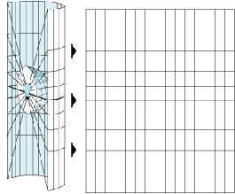

# GIS基本概念

## 坐标系

### 大地水准面和参考椭球体
大地水准面是一个假想的由地球自由静止的海水平面扩展延伸而形成的闭合曲面，通常被认为是地球的真实轮廓。因为地球表面各个点的重力方向不同，因此大地水准面是个不规则的椭球体。  
  
为了数学计算、测绘制图的需要，引入了一个规则的参考椭球体来描绘地球。参考椭球体是由二维平面的椭圆围绕着短轴旋转而成的。参考椭球体的长半轴就是地心距赤道的距离，短半轴指的是地心距地球极点的距离。例如：目前最常用的参考椭球，WGS84（6378137，6356752.31424518）.

### 基准面
参考椭球体定义了地球的形状，但是它还不能很好地描述地球上每个地方的具体情况，所以就出现了将椭球体进行偏移以此更好地逼近当地真实的地表形状，也就是引入了**基准面**的概念。  
将椭球体的中心移动到地球的质心，这种做法叫做地心基准面，目前世界上广泛采用的WGS 1984就是采用这种地心坐标系，GPS也是基于此坐标系。  
还有一种偏移的方法是，将地表上的某一点和椭球的某一点完全贴合，这种做法叫做本地基准面，例如国内的“北京54”和“西安80”。  

### 地理坐标系
地理坐标系，就是我们常用的，使用经度、纬度来指定地球表面上的点。纬度相对与赤道进行测量，范围是-90度（南极点）到+90度（北极点）；经度相对于本初子午线进行测量，范围是-180度（向西）到180（向东）。  
  

### 投影坐标系
相对于地理坐标系使用三维球面来表示地球上的位置，投影坐标系是基于二维平面中的定义。我们经常使用的Google Map，高德地图都是经过投影转换才得以再二维平面进行呈现。另外，很多的空间分析都是要基于投影坐标系进行运算的。  
地球投影的方式有很多种，最著名的就是墨卡托投影，采用圆柱投影的方式，假设地球被围在一中空的圆柱里，其基准纬线与圆柱相切（赤道）接触，然后再假想地球中心有一盏灯，把球面上的图形投影到圆柱体上，再把圆柱体展开，这就是一幅选定基准纬线上的“墨卡托投影”绘制出的地图。[“没有一张平面地图是不失真的”][3]  
  

## OGC

开放地理空间联盟 (OGC) 的 Web 地图服务 (WMS) 规范是一种在 web 上提供和使用动态地图时需遵守的国际规范。如果要在不同的平台和客户端之间以一种开放并经认可的方式提供 Web 地图，则 WMS 服务非常有用。任何原生支持 WMS 规范的客户端均可查看和使用您的服务。到目前为止，已发布了四个版本的 WMS 规范。这些版本是 v1.0.0、v1.1.0、v1.1.1 和 v1.3.0（最新版本）。

### WMS

Web 地图服务（WMS）能够根据用户的请求返回相应的地图（包括PNG，GIF，JPEG等栅格形式或者是SVG和WEB CGM等矢量形式）。客户端应用程序通过向服务的 URL 附加参数来使用 WMS 服务。

规范中定义的WMS支持的操作包括:
- 请求服务的元数据(GetCapbilities) 
- 请求地图图像(GetMap) 
- 请求关于地图要素的信息 (GetFeatureInfo) 
- 请求用户自定义样式 (GetStyles) 
- 请求图例符号 (GetLegendGraphic)

由各种不同GIS Server发布的WMS服务无需支持所有操作，但如果作为基本 WMS，则必须至少支持 GetCapabilities 和 GetMap 操作。

[WMS GetCapabilities实例][4]  
[GetMap实例][5](可以修改QueryString来获取到内容不同的地图图片)

### WFS

WFS 是通过 Web 提供地理要素服务的开放规范。Web 要素服务（WFS）支持对地理要素的插入，更新，删除，检索和发现服务。在通过 WFS 服务提供数据的情况下，任何使用 Web 服务的应用程序均可访问地图或企业级地理数据库中的地理要素。与返回地图图像的 OGC Web 地图服务 (WMS) 不同，WFS 服务返回的是带有几何和属性信息的实际要素，客户端可以将这些要素与属性用于任何类型的地理空间分析。WFS 服务也支持过滤器，由此用户可以在数据上执行空间查询和属性查询。

WFS 服务可用于任何支持 WFS 的客户端。通常，Web 浏览器是 WFS 服务最简单的客户端。您可通过 HTTP 发出 WFS 请求，之后，响应或异常将会通过浏览器返回。所有的 WFS 服务都支持三种操作：
- GetCapabilities
- DescribeFeatureType
- GetFeature。

[GetCapabilities实例][6]  
[GetFeature实例][7]  
通过WFS的web编辑，需要使用到事务性WFS服务，实现对源地理数据库的数据进行更改。

### WPS
开放地理空间联盟 (OGC) 的网络处理服务 (WPS) 规范是一种用于在 Web 上提供和执行地理空间处理的国际规范。您可通过在发布地理处理服务时启用 WPS 功能来创建 WPS 服务。

客户端应用程序可通过向服务的 URL 附加参数来使用 WPS 服务。发布的 WPS 服务支持以下操作：
- 请求服务的元数据 (GetCapabilities)
- 请求有关可运行在服务上的进程的详细信息 (DescribeProcess)
- 请求运行一个由 WPS 服务实现的进程 (Execute)

[WPS实例][8]

## 栅格和矢量

### 栅格
栅格，由格网组成的像元矩阵，每个像元代表一种专题或业务指标。栅格结构简单，可以是卫星影像、航空相片、数字图片等。
  
采用栅格的主要优点是，数据结构简单，可以和二维数组对应；传输量小。

### 矢量
矢量和要素的概念相关，它是通过文字描述的形式来表示一个空间对象，如SVG，XML，JSON。矢量比栅格在地图呈现上有很大的灵活性，不仅仅是一个个像元来显示，还可以加入很多符号，也不会出现失真的问题。同时因为与要素的对应关系，可以方便地操作空间对象。

> **参考**  
> 1. [深入浅出空间参考][1]  
> 2. [坐标系][2]

[1]:http://www.360doc.com/content/12/1123/14/3046928_249753250.shtml
[2]:http://help.arcgis.com/zh-cn/arcgisdesktop/10.0/help/index.html#/na/003r0000000p000000/
[3]:http://discovery.163.com/14/0630/02/9VV42IN600014N6R.html
[4]:http://sampleserver1.arcgisonline.com/ArcGIS/services/Specialty/ESRI_StatesCitiesRivers_USA/MapServer/WMSServer?service=WMS&request=GetCapabilities&version=1.3.0
[5]:http://sampleserver1.arcgisonline.com/ArcGIS/services/Specialty/ESRI_StatesCitiesRivers_USA/MapServer/WMSServer?VERSION=1.3.0&REQUEST=GetMap&CRS=CRS:84&BBOX=-178.217598,18.924782,-66.969271,71.406235&WIDTH=765&HEIGHT=360&LAYERS=0,1&STYLES=,&EXCEPTIONS=application/vnd.ogc.se_xml&FORMAT=image/png&BGCOLOR=0xFFFFFF&TRANSPARENT=TRUE
[6]:http://demo.opengeo.org/geoserver/wfs?request=getcapabilities
[7]:http://demo.opengeo.org/geoserver/wfs?request=getfeature&typeName=tasmania_roads
[8]:http://demo.opengeo.org/geoserver/wps?request=getcapabilities
