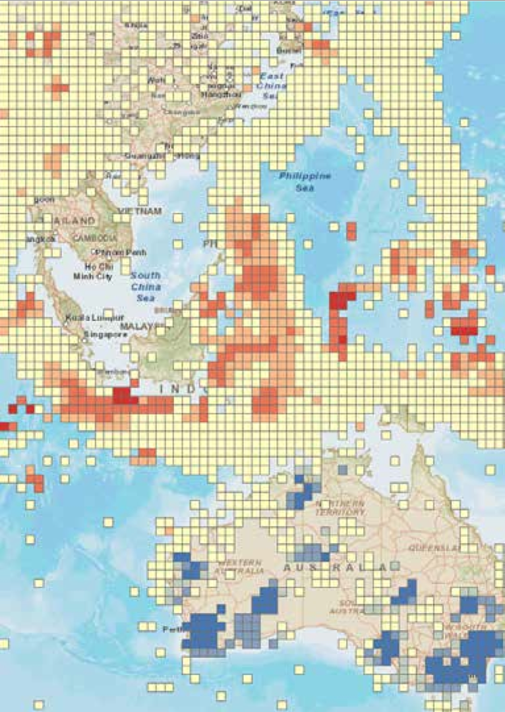

# 云GIS服务

## Scenario
1. 面向企业的大数据量的地图应用
2. 有少量的空间分析功能

## Servcie
1. CartoDB
CartoDB，一种实现空间数据存储和呈现的开源框架，同时提供付费的在线云服务。CartoDB最大的优势体现在：大数据量下的渲染性能和丰富的可视化呈现。可采用订购服务，同步数据的方式，集成地图服务在应用中；也可以采用自己搭建CartoDB集成环境，（可能出于数据安全的考虑）。

  

2. ArcGIS Online Service
ESRI公司提供的一种在线云GIS平台，同样提供数据托管和服务共享的平台。它的优势在于，可以使用网络共享的专题资源，如人口、污染指数等。
